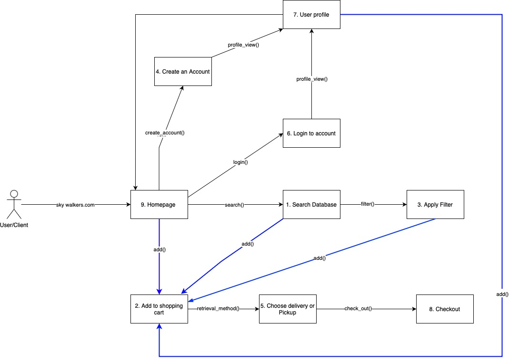

# CPSC362 Project Vision Group 9
CPSC362 Group Activity 1 

--- 
##  Fashion Website
Title: Sky Walkers 

---
## Project Vision

For customers seeking a online footwear marketplace who are looking for Sky Walkers branded shoes. The Sky Walkers shop is a website that personalizes the users experience and provides filtered shoes. Unlike other products, our site is agressively priced.

---
## Functional Requirements 
1. Search Inventory
-  Description: User can search the shoes in stock from the main Homepage

2. Add to Shopping Cart
-  Description: User can add items to shopping cart from Homepage, Search, Filter pages

3. Apply Filters
-  Description: User can apply filters after searching to categorize prices, color, size, etc

4. Create User Account
-  Description: From the homepage, user can create an account

5. Choose Delivery or Pickup
-  Description: User can decide on pickup or delivery once cart is complete

6. Login 
-  Description: From the homepage, user can login in to created an account

7. User Profile
-  Description: Contains all user data

8. Checkout
-  Description: User can complete a purchase after choosing Delivery or Pickup

9. Homepage
-  Description: www.Skywalkers.com leads to homepage

---
## Non-Functional Requirements 

1. Site Performance
- Description: Allow for thousands of users to access site
2. Increase Scalability
- Description:  Increase amount of users handled during events like black friday
3. Site Availability
- Description: do not let site fail during events
4. User Security
- Description: User  authentication
5. External Interface requirements 
- Description: Make website fluid and clean

