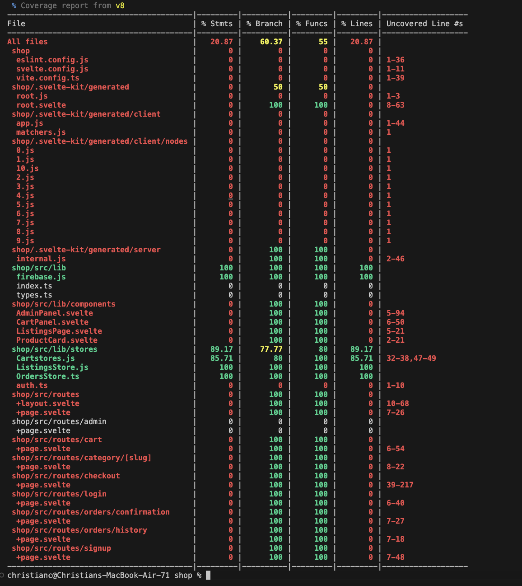
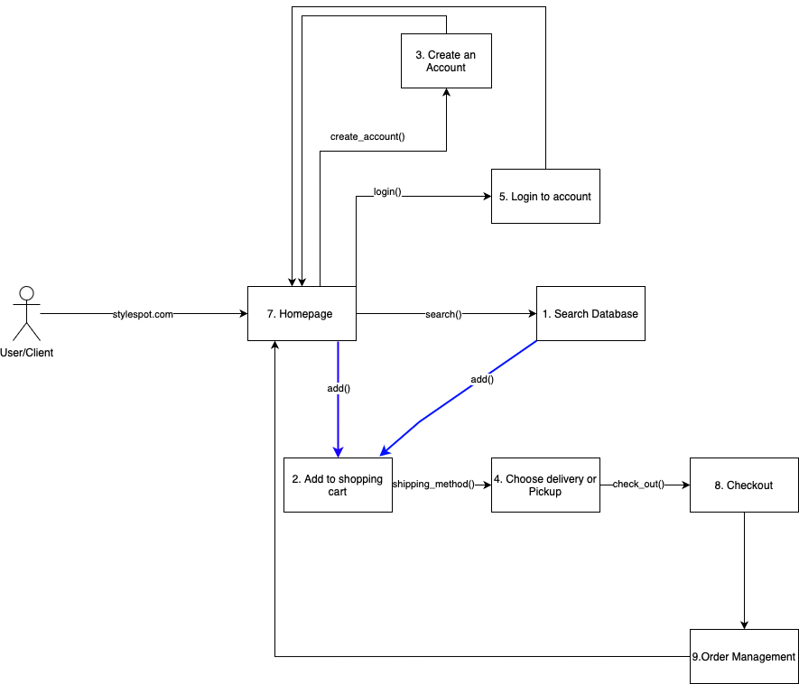
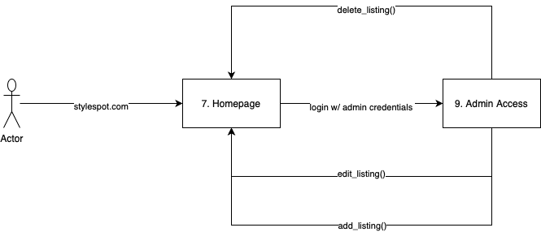

# CPSC362 Project Documentation

# Video
## https://youtu.be/UEX3rmVnNxQ
## Documentation: https://docs.google.com/document/d/1z9JnL5rlp2b4TqFHf24xwzBZRwOxxaWdH6wWwLpDMxc/edit?usp=sharing 
## Presentation: https://docs.google.com/presentation/d/1SAcPD3F3Jpsc1Kl-I9GF1gDGfxSgUtfwRUYLD_D36Ek/edit?usp=sharing
--- 
##  Fashion Website
Title: StyleSpot

---
## Project Vision

For customers seeking an online marketplace, looking for StyleSpot branded clothing. The StyleSpot shop is a website that personalizes the user's experience and provides a variety of clothing options. Unlike other products, our site is aggressively priced.

---
## How to Run Application
These were the versions used to build the application:
 * `npm: 11.3.0`
 * `node: 20.17.0`

Run `npm install` locally in the /shop folder.

Use the following command to local host the code:

`npm run dev -- --open`
---
## How to run tests and coverage tests
`npm run test`
or 
`npx vitest run --reporter verbose`

`npm run coverage`

---
## Functional Requirements 
1. Search Inventory
-  Description: User can search the shoes in stock from the main Homepage

2. Add to Shopping Cart
-  Description: User can add items to shopping cart from Homepage, Search, Filter pages

3. Create User Account
-  Description: From the homepage, user can create an account

4. Shipping Method
-  Description: User can pick desired shipping method

5. Login 
-  Description: From the homepage, user can login in to created an account

6. Checkout
-  Description: User can complete a purchase after choosing Delivery or Pickup

7. Homepage
-  Description: www.Skywalkers.com leads to homepage

8. Order Management
-  Description: User can view past orders and status of them

9. Admin Access
- Admin can create, edit, and delete listings

---
## Non-Functional Requirements 

1. Site Performance
- Description: Allow for thousands of users to access site
2. Increase Scalability
- Description:  Increase amount of users handled during events like black friday
3. Site Availability
- Description: do not let site fail during events
4. User Security
- Description: User  authentication
5. External Interface requirements 
- Description: Make website fluid and clean

